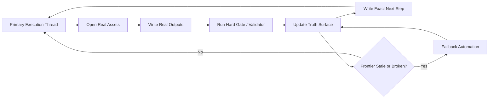

# Goal-First AI Workflow Playbook

Design patterns, templates, and examples for long-running AI workflows that keep making real progress.

AI systems rarely fail only by stopping.

More often, they fail by staying busy:

- notes keep growing;
- status keeps refreshing;
- multiple threads keep talking;
- token usage keeps climbing;
- but the real task barely moves.

This repository is a practical playbook for avoiding that failure mode.

It shows how to run long-lived AI workflows with:

- one primary execution thread;
- file-backed continuation;
- hard gates tied to outputs;
- exact handoffs;
- fallback automation only when recovery is actually needed.

The core rule is simple:

> simplify orchestration aggressively, but do not simplify the actual work

## Architecture at a glance

## Why this matters

Many AI workflow systems optimize for liveness instead of usefulness.

They are very good at proving that something is running, but much worse at proving that the target task is moving forward in a reliable, inspectable way.

This playbook is for people who want the opposite:

- less theater;
- lower token waste;
- better resumability;
- clearer accountability;
- stronger separation between activity and progress.

## Who this is for

This repository is useful if you are building:

- agentic coding workflows;
- multi-step internal assistants;
- document or knowledge pipelines;
- long-running operational automations;
- evaluation or review loops;
- any AI workflow that has to survive interruption and resume correctly.

## The model in one minute

The recommended loop is:

1. Read a compact truth surface.
2. Pick one bounded real task.
3. Open the real assets or ledgers.
4. Write source-backed outputs.
5. Run a focused validator.
6. Leave an exact continuation note.
7. Wake fallback automation only if the main path is stale or broken.

What does not count as progress:

- fresh timestamps;
- more summaries;
- more agents;
- more status churn;
- more coordination with no evidence.

Real progress means something important changed and the next worker can verify it.

## What you get in this repo

- [docs/getting-started.md](docs/getting-started.md): the fastest way to apply the playbook to a real workflow.
- [docs/final-architecture.md](docs/final-architecture.md): the full operating model and execution loop.
- [docs/case-study-overnight-monorepo.md](docs/case-study-overnight-monorepo.md): a representative public case study for overnight AI work in software delivery.
- [docs/use-cases.md](docs/use-cases.md): where this playbook is most useful and how to adapt it.
- [docs/anti-patterns.md](docs/anti-patterns.md): common failure modes such as governance theater and candidate inflation.
- [docs/design-rules.md](docs/design-rules.md): hard rules for handoffs, validation, start gates, and anti-simplification.
- [docs/faq.md](docs/faq.md): answers to common implementation and positioning questions.
- [docs/why-not-agent-swarms.md](docs/why-not-agent-swarms.md): the repository's point of view on when extra agents help and when they become theater.
- [docs/discoverability.md](docs/discoverability.md): recommended GitHub description, topics, keywords, and sharing angles.
- [docs/evolution.md](docs/evolution.md): how the model evolved from heavier orchestration to a leaner, more durable form.
- [principles/](principles): short standalone principles you can reuse in your own workflow docs.
- [starter-kit/](starter-kit): a minimal folder you can copy into a real project to try the model quickly.
- [templates/](templates): reusable truth surfaces, handoff notes, audits, method learning, and hard-gate files.
- [examples/](examples): small examples showing what the templates look like in practice.

## Start here

If you want the shortest useful path through the repository:

1. Read [docs/getting-started.md](docs/getting-started.md).
2. Read [docs/final-architecture.md](docs/final-architecture.md).
3. Read [docs/case-study-overnight-monorepo.md](docs/case-study-overnight-monorepo.md) to see the model in a realistic setting.
4. Copy [starter-kit/](starter-kit) or the files in [templates/](templates) into your own project.
5. Open [examples/README.md](examples/README.md) and pick the example closest to your workflow.
6. Make your first validator fail on fake progress, not just total failure.

## What makes this different

This is not a framework that tries to automate everything.

It is a control philosophy for making long-running AI work:

- easier to trust;
- easier to resume;
- easier to audit;
- harder to game;
- cheaper to run over time.

Instead of adding more coordination by default, it asks a harder question:

what is the smallest control surface that still keeps the work honest?

## A representative case

If you want one concrete story before diving into the templates, start with:

- [Overnight Monorepo Maintenance Case Study](docs/case-study-overnight-monorepo.md)

It shows how this playbook fits a workflow where AI works across many files, repeated tests, and overnight handoffs without being allowed to fake completion.

## Anti-hype stance

This project intentionally avoids grand claims.

It does not promise:

- universal autonomy;
- fully self-driving work without oversight;
- guaranteed correctness;
- a magic multi-agent controller;
- a replacement for real domain validation.

It is a practical operating playbook for teams and individuals who want AI workflows to be useful for longer than a single prompt.

## Suggested GitHub metadata

Repository name ideas:

- `goal-first-ai-workflow-playbook`
- `goal-first-autonomy`
- `ai-workflow-continuity-playbook`

Suggested topics:

- `ai-autonomy`
- `ai-workflows`
- `agentic-workflow`
- `workflow-design`
- `agentic-systems`
- `automation`
- `operations`
- `human-in-the-loop`
- `knowledge-work`
- `context-engineering`
- `coding-agents`
- `prompt-engineering`
- `playbook`

## License

[MIT](LICENSE)
