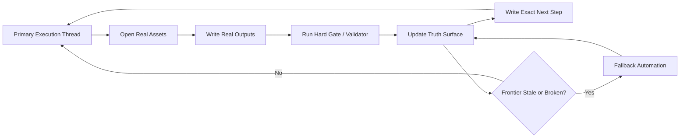

# Goal-First AI Workflow Playbook

> English | [中文](README.zh-CN.md)

Design patterns, templates, and starter kits for long-running AI workflows that keep making real progress.

面向长期 AI 工作流的设计模式、模板和 starter kit，核心目标是让系统持续推进真实工作，而不是持续制造“看起来很忙”的假进展。

## The problem this repository solves | 这个仓库解决什么问题

AI systems rarely fail only by stopping.

More often, they fail by staying busy:

- notes keep growing;
- status keeps refreshing;
- multiple threads keep talking;
- token usage keeps climbing;
- but the real task barely moves.

很多 AI 系统不是因为彻底停掉才失败，而是因为它们一直在“活着”：

- 记录越来越多；
- 状态不断刷新；
- 多个线程一直在对话；
- token 持续消耗；
- 但真正的任务几乎没有推进。

This repository is a practical playbook for preventing that failure mode.

这个仓库是一套非常务实的 playbook，用来防止这种“假忙碌、真停滞”的长期工作流失控。

## The core idea | 核心思想

Run long-lived AI workflows with:

- one primary execution thread;
- file-backed continuation;
- hard gates tied to outputs;
- exact handoffs;
- fallback automation only when recovery is actually needed.

把长期 AI 工作流收敛到几个真正有用的控制点：

- 一个主执行线程；
- 文件化的连续性状态；
- 绑定真实输出的 hard gate；
- 精确的下一步交接；
- 只有在恢复需要时才唤醒的兜底自动化。

The central rule is simple:

> simplify orchestration aggressively, but do not simplify the actual work

最核心的规则很简单：

> 可以极度简化编排，但绝不能偷偷简化真正的工作义务

## Architecture at a glance | 架构一览

## Why it matters | 为什么它有价值

Many AI workflow systems optimize for liveness instead of usefulness.

They are very good at proving that something is running, but much worse at proving that the target task is moving forward in a reliable, inspectable way.

很多 AI workflow 系统优化的是“还活着”，而不是“真有用”。

它们很擅长证明自己还在运行，却不擅长证明目标任务正在以可靠、可检查的方式被推进。

This playbook is for people who want:

- less theater;
- lower token waste;
- better resumability;
- clearer accountability;
- stronger separation between activity and progress.

如果你要的是下面这些东西，这个仓库就是为你准备的：

- 更少的编排表演；
- 更低的 token 浪费；
- 更强的断点恢复能力；
- 更清晰的责任归属；
- 更明确地区分“活动”与“进展”。

## Who this is for | 适合谁

This repository is useful if you are building:

- agentic coding workflows;
- multi-step internal assistants;
- document or knowledge pipelines;
- long-running operational automations;
- evaluation or review loops;
- any AI workflow that has to survive interruption and resume correctly.

这个仓库尤其适合这些场景：

- agentic coding workflow；
- 多步骤内部助手；
- 文档 / 知识处理流水线；
- 需要过夜跑、连续跑的自动化流程；
- 评审、校验、审核类工作流；
- 任何需要跨 session 正确接续的 AI 工作流。

## The model in one minute | 一分钟理解这套模型

The recommended loop is:

1. Read a compact truth surface.
2. Pick one bounded real task.
3. Open the real assets or ledgers.
4. Write source-backed outputs.
5. Run a focused validator.
6. Leave an exact continuation note.
7. Wake fallback automation only if the main path is stale or broken.

推荐的执行闭环如下：

1. 先读紧凑 truth surface。
2. 选择一个边界清晰的真实任务。
3. 打开真正的源文件、资产或 ledger。
4. 写出有依据的真实输出。
5. 运行聚焦的 validator。
6. 留下精确的继续点。
7. 只有当主路径 stale 或损坏时，才唤醒 fallback automation。

What does not count as progress:

- fresh timestamps;
- more summaries;
- more agents;
- more status churn;
- more coordination with no evidence.

以下内容不应被算作“进展”：

- 更新时间戳变新；
- 摘要越来越多；
- agent 越来越多；
- 状态文件越来越热闹；
- 没有证据支撑的协调动作。

Real progress means something important changed and the next worker can verify it.

真正的进展，是有重要内容真的发生了变化，而且下一个接手者能验证这件事。

## What you get in this repo | 仓库里有什么

- [docs/getting-started.md](docs/getting-started.md): the fastest way to apply the playbook to a real workflow.
- [docs/final-architecture.md](docs/final-architecture.md): the full operating model and execution loop.
- [docs/case-study-overnight-monorepo.md](docs/case-study-overnight-monorepo.md): a representative public case study for overnight AI work in software delivery.
- [docs/use-cases.md](docs/use-cases.md): where this playbook is most useful and how to adapt it.
- [docs/anti-patterns.md](docs/anti-patterns.md): common failure modes such as governance theater and candidate inflation.
- [docs/design-rules.md](docs/design-rules.md): hard rules for handoffs, validation, start gates, and anti-simplification.
- [docs/faq.md](docs/faq.md): answers to common implementation and positioning questions.
- [docs/why-not-agent-swarms.md](docs/why-not-agent-swarms.md): when extra agents help and when they become theater.
- [docs/discoverability.md](docs/discoverability.md): GitHub description, topics, keywords, and sharing angles.
- [docs/evolution.md](docs/evolution.md): how the model evolved from heavier orchestration to a leaner form.
- [principles/](principles): reusable standalone principles.
- [starter-kit/](starter-kit): a minimal folder you can copy into a real project quickly.
- [templates/](templates): reusable truth surfaces, handoffs, audits, and hard-gate files.
- [examples/](examples): small examples showing what the control surface looks like in practice.

主要内容包括：

- 上手文档；
- 完整架构说明；
- 公开可讲的案例；
- use cases；
- 反模式总结；
- 设计规则；
- FAQ；
- 为什么不是 agent swarm；
- discoverability / 关键词 / 分享角度；
- starter kit、templates、examples。

## Start here | 建议从这里开始

If you want the shortest path:

1. Read [docs/getting-started.md](docs/getting-started.md).
2. Read [docs/final-architecture.md](docs/final-architecture.md).
3. Read [docs/case-study-overnight-monorepo.md](docs/case-study-overnight-monorepo.md).
4. Copy [starter-kit/](starter-kit) or [templates/](templates) into your project.
5. Open [examples/README.md](examples/README.md).
6. Make your first validator fail on fake progress.

如果你想最快看懂并开始试：

1. 先看 [docs/getting-started.md](docs/getting-started.md)
2. 再看 [docs/final-architecture.md](docs/final-architecture.md)
3. 看案例 [docs/case-study-overnight-monorepo.md](docs/case-study-overnight-monorepo.md)
4. 直接复制 [starter-kit/](starter-kit) 或 [templates/](templates)
5. 再参考 [examples/README.md](examples/README.md)
6. 第一件事是让 validator 能失败在“假进展”上

## Why this is different | 这个项目和别的 agent 项目有什么不同

This is not a framework that tries to automate everything.

It is a control philosophy for making long-running AI work:

- easier to trust;
- easier to resume;
- easier to audit;
- harder to game;
- cheaper to run over time.

这不是一个“试图自动化一切”的框架。

它更像一套长期 AI 工作的控制哲学，让工作流：

- 更值得信任；
- 更容易恢复；
- 更容易审计；
- 更不容易自欺欺人；
- 长期运行成本更低。

Instead of adding more coordination by default, it asks:

what is the smallest control surface that still keeps the work honest?

它不是默认增加更多 agent 和更多编排，而是追问：

> 最小要保留什么控制面，才能让工作保持真实和诚实？

## A representative case | 一个代表性案例

If you want one concrete story before diving into the templates, start with:

- [Overnight Monorepo Maintenance Case Study](docs/case-study-overnight-monorepo.md)

如果你想先看一个更容易公开传播、又足够真实的案例，建议先看：

- [Overnight Monorepo Maintenance Case Study](docs/case-study-overnight-monorepo.md)

It shows how this playbook fits a workflow where AI works across many files, repeated tests, and overnight handoffs without being allowed to fake completion.

这个案例展示了：当 AI 需要跨文件、多轮验证、过夜接力时，怎样避免它看起来做了很多，实际上却没有完成真正的工作。

## Anti-hype stance | 反炒作立场

This project does not promise:

- universal autonomy;
- fully self-driving work without oversight;
- guaranteed correctness;
- a magic multi-agent controller;
- a replacement for real domain validation.

这个项目不承诺：

- 通用自治；
- 完全无监督的自驾驶工作；
- 保证正确；
- 神奇的多 agent 魔法控制器；
- 替代真实领域验证。

It is a practical operating playbook for teams and individuals who want AI workflows to stay useful longer than a single prompt.

它是一套实战导向的 operating playbook，适合希望 AI 工作流在一个 prompt 之外仍然保持有用的人。

## Suggested GitHub metadata | 建议的 GitHub 元数据

Repository name ideas:

- `goal-first-ai-workflow-playbook`
- `goal-first-autonomy`
- `ai-workflow-continuity-playbook`

Suggested topics:

- `ai-autonomy`
- `ai-workflows`
- `agentic-workflow`
- `workflow-design`
- `agentic-systems`
- `automation`
- `operations`
- `human-in-the-loop`
- `knowledge-work`
- `context-engineering`
- `coding-agents`
- `prompt-engineering`
- `playbook`

额外建议你在 GitHub 项目简介或外部分享里自然包含这些关键词：

- long-running AI workflows
- exact continuation
- hard gates
- workflow control plane
- anti-fake-progress
- bounded autonomy
- file-backed continuity
- overnight AI execution
- AI workflow recovery

## License

[MIT](LICENSE)
